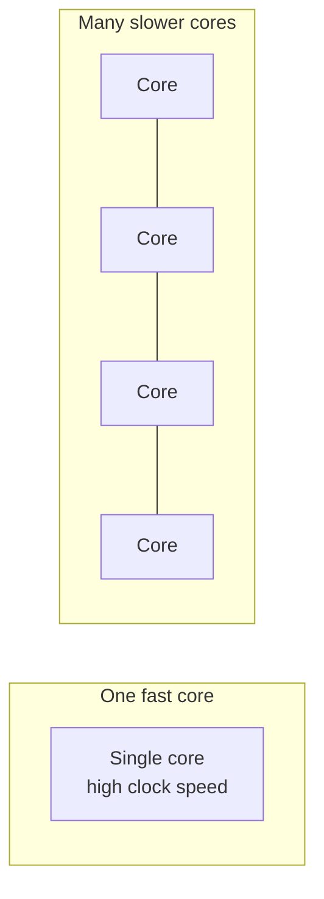
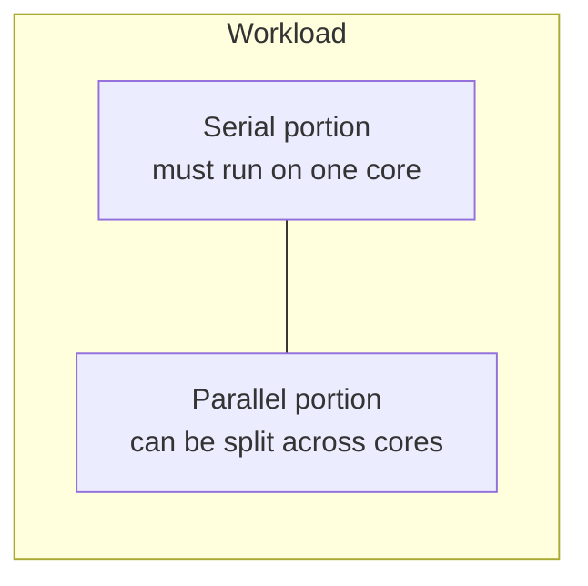
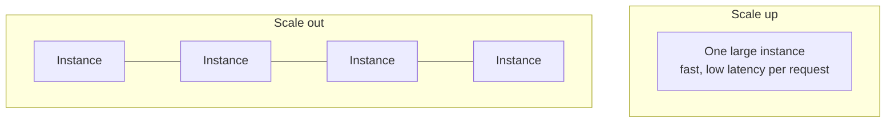
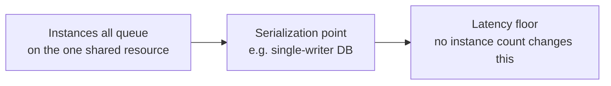
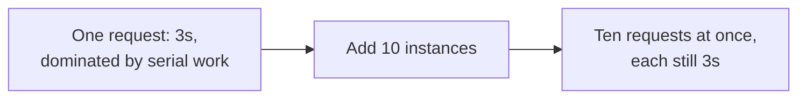
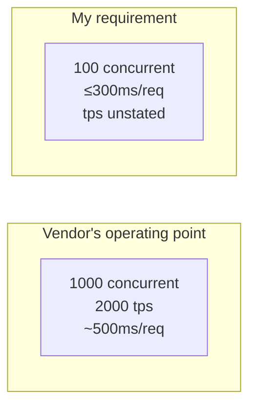

# Performance and Scalability Are Not the Same Problem

!!! note "A note on terms"
    **Performance** means how fast one unit of work completes — latency.
    **Scalability** means how total capacity changes as you add resources
    — throughput. Two different numbers. Nobody I work with treats them
    that way, and that's the whole rant.

## Introduction

Someone says "we need to improve performance" and half the room hears
*latency*, the other half hears *scale*, and nobody clocks that the room
just split in two — because "performance" isn't a real word. It's what
people say when they haven't worked out which problem they've got.

Ask if a system's fast, you get response time. Ask if it scales, you get
box count. Ask why it's slow under load and watch someone hand you a
throughput fix for a latency problem, or vice versa, because both got
dumped into the same Jira ticket titled "Performance," no further detail,
next question.

That's not sloppy vocabulary. That's sloppy thinking, wearing sloppy
vocabulary as a disguise.

A system can be fast and not scale. It can scale and not be fast. Fixing
one doesn't fix the other, and some fixes for one make the other worse.
If someone tells you "performance work" covers both, they haven't
checked.

Chip design worked this out and moved on twenty years ago. Backend
engineering is still relearning it, one autoscaling group at a time.

## 1. One Fast Core, or a Handful of Slower Ones

For decades, "make it faster" meant one thing: turn up the clock. Then
physics sent the bill — power and heat outrun clock speed, you can't cool
the chip fast enough past a point, and the industry hit that wall in the
mid-2000s.

The answer was more cores, each one no faster than before. Usually
slower — power budget doesn't negotiate.

Call both chips "high performance" and you've said nothing. Only one is
fast. The many-core chip loses every single-thread race and wins on the
only thing it was built for: total work done, when there's enough of it
to split up.

Two questions, same chip, different answers:

* How fast does one thread run?
* How much total work gets through per second?

Eight slow cores can lose the first badly and win the second easily.
That's not a paradox, it's the design brief — and it's the same choice
your platform team makes every time they pick "bigger box" or "more
boxes" and call it the same kind of scaling.

## 2. Amdahl's Law, Read Too Late as Usual

More cores only help the part of the work that can run in parallel. The
part that can't — step two waiting on step one — runs at one core's speed
no matter how many are sitting idle next to it.

That's Amdahl's Law. Forget the formula, keep the shape: a quarter of the
work is serial, you are never getting more than roughly a 4x speedup,
full stop. Buy a thousand cores and watch the number barely move.

More hardware doesn't lift that ceiling. Finding more parallel work does,
or making the serial chunk faster — which is a performance fix, not a
scaling one. Reach for the wrong one and you've bought nothing.

## 3. Same Argument, Different Nouns

Swap "core" for "instance." Nothing changes. That's what gets me — it's
not a subtle analogy, it's the same graph with different labels, and
people still miss it.

Scale up buys latency: one request gets faster because it isn't sharing
anything. Scale out buys throughput and does roughly nothing for any one
request's latency — sometimes it makes it worse, once you've added a
network hop and something everyone still has to agree on.

The ceiling's the same ceiling, different name. Whatever can't be split —
a global lock, a single-writer database, a shared cache everyone
round-trips through — is your serial fraction. Add instances all day.
Eventually that's the only thing setting your latency, because everything
parallel is already maxed out and queued behind it.

Forty instances hammering one un-scaled Postgres primary is eight slow
cores waiting on a shared cache line, dressed up in a service mesh so
nobody recognises it.

## 4. Two Ways to Get This Wrong

**Throwing instances at a latency problem.** A request is slow, so
someone autoscales it. Nothing about that request was a capacity problem
— it's a chain of dependent calls, an unindexed query, three round trips
that should've been one. Now there are more parallel copies of a slow
thing. "This is slow" doesn't move, because it was never going to.

**Optimizing a throughput problem.** The system falls over under load, so
someone makes the hot path faster — tighter code, a cache, a rewrite. All
real wins on a single request. The system still falls over at the same
concurrency, because the ceiling was never per-request speed — it was a
fixed connection pool, or a cache that doesn't share across instances, or
a rate limiter sized for one box nobody revisited.

First one's more common. Second one's more embarrassing, because it
usually comes with a demo that looks great in isolation and changes
nothing in production.

## 5. "2000 TPS" Is a Point on a Curve, Not a Number

I've heard this pitch enough times to recite it: "we can do 2000
transactions per second — you just need to send about 1000 requests in
parallel." Delivered like a spec. Taken, usually, as a compliment.

It's Little's Law, unstated, and it's not saying what they think it's
saying. Concurrency = throughput × latency. Flip it: latency = concurrency
÷ throughput.

Run their own numbers through it: 1000 concurrent, 2000 tps, implies
~500ms average latency. They didn't say that part. "2000 tps" gets said
like one number describing the system — same trick as calling both chips
in section 1 "high performance." It's one operating point, bought with
500ms of latency and a thousand requests held open to pay for it.

My requirement was never "can you do 2000 tps." It was 100 in flight,
answered inside 300ms. Different point on the same curve. Run my numbers
through their own implied latency: 100 concurrent at ~500ms gets me
100 ÷ 0.5 = 200 tps — an order of magnitude under the headline, and still
not inside 300ms, because "2000 tps" never promised me 300ms. It promised
500, at a concurrency I don't have.

The 2000 tps figure isn't a lie. It's a correctly measured many-core
answer to a question I never asked, standing in for one I did. That gap
doesn't surface on the sales call — it surfaces in production, after
"2000 tps, benchmarked" is already in the procurement doc and nobody
wants to reopen it. So ask before the doc gets written: what's the
latency at *my* concurrency, not the one that flatters your number.

## 6. "Highly Performant" Is Not an Answer

At least the vendor pitch attaches a number to its claim. The version I
hear more is a team, asked if their service holds up, saying "it's highly
performant" or "don't worry, it's highly scalable" — full confidence, as
if that settles it.

It settles nothing. It doesn't name the axis or the operating point.

"Highly performant" — fast doing what, at what concurrency? A service can
be genuinely fast alone and fall off a cliff the second three callers
show up, because nobody load-tested past one. Not a lie. A true statement
about one point on the curve, sold as if it held everywhere on it.

"Highly scalable" is worse — it usually means "we can add instances" and
says nothing about what any single call costs. Throughput can climb
cleanly with every instance added while every response still takes 900ms,
forever, because 900ms was never a capacity problem and instances were
never going to touch it. Scalable and slow coexist constantly.

Neither is a spec. Both are marketing copy dodging the one question the
calling service actually has:

> **At the concurrency I'm sending you, what's my latency distribution —
> and does it hold under my load pattern, not your load test's?**

That's a p50/p99 at a stated concurrency. Not an adjective. "Highly
performant" is what a team says when they haven't measured that, or
measured it somewhere flattering, and either way the calling service
finds out which, in production, the first time real traffic doesn't
match the benchmark. The owning team keeps the adjective. The calling
service gets the incident.

I don't ask teams if their service is fast or scalable anymore. I ask for
the number, at my concurrency — and I've stopped being surprised how
often nobody has one ready.

## 7. Ask Which Axis Before You Touch Either Lever

The fast-core framing earns its keep by forcing the real first question,
which isn't "how do we make this faster or bigger":

> **Is this about how long one thing takes, or how much the system can
> do at once?**

Latency complaint — one request, one user, "why is this slow" — find the
serial chain. The dependent calls, the lock, the round trip nobody
questioned. More instances won't touch it. I don't care how the
autoscaling's tuned.

Throughput complaint — fine per request, falls over past some
concurrency, costs climb faster than traffic — find the shared, unscaled
thing everything's converging on. A faster single request won't touch
that either, no matter how proud you are of the rewrite.

Most systems carry both ceilings, at different layers, and the failure
isn't picking the wrong one forever. It's picking the wrong one first —
shipping the implementation, watching the graph not move, and only then
asking which axis the complaint was ever on. That question is free. Ask
it before the change, not after.

Chip people worked this out fifteen years before backend teams did, and
put two numbers on the spec sheet instead of arguing about it. Borrow the
habit. Whatever you mean by "performs well," it's at least two numbers,
and they don't move together — and if your ticket's only got room for
one, you haven't scoped the problem, you've picked a word.
