# Service Fragmentation, Failure Boundaries and Pointless Dependencies

!!! note "A note on terms"
    This is written around **service architecture**, with "microservice" used
    only when discussing the industry claim around it. It also includes a
    deliberately simplified **Netflix-style decomposition** to show the
    contrast: capability services owning the data/state they need to
    operate, rather than synchronously walking back through a common service
    graph. Netflix's published engineering material supports the underlying
    pattern: domain-specific ownership, locally held state distributed by
    Kafka, and actively removing fragile multi-service dependency chains
    ([Netflix TechBlog][1]).

## Introduction

I have been building and deploying systems made up of multiple cooperating
services for over twenty-five years. I have never found the term
*microservice* particularly useful.

A service is a service.

The important questions are not whether a service is sufficiently small to
qualify for a fashionable label. The important questions are whether the
boundary is useful, whether the service owns a coherent capability, whether it
can evolve independently, and whether the boundary provides meaningful
isolation.

Separating software into multiple services can be extremely effective.

Separating software into more services does not automatically make it
better.

The problem starts when service decomposition becomes **service
fragmentation**: a logically cohesive capability is split across multiple
independently deployed processes while those services remain tightly coupled
in operation, evolution and failure.

At that point the architecture has not removed the dependency.

It has distributed it.

## 1. A Service Is Not Independent Because It Has Its Own Deployment

A common argument for splitting a system into smaller services is that each
service can then be developed, deployed and improved independently.

That sounds reasonable.

But it only works when the services are actually independent.

Giving something:

* its own repository;
* its own container;
* its own API;
* its own CI/CD pipeline;
* its own deployment;
* its own team;

does not make it architecturally independent.

It makes it **independently deployable**.

Those are not the same thing.

Consider:

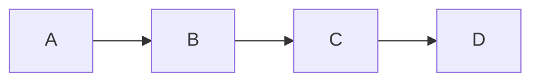

All four services may have completely independent deployment pipelines.

But if A cannot operate without B, B cannot operate without C, and C cannot
operate without D, then the business capability is not independent.

The boxes are separate.

The capability is not.

## 2. Service Count Tells Us Almost Nothing

There is very little useful information in a statement such as:

> The platform contains forty services.

Forty services could represent forty genuinely independent capabilities.

Or it could represent one large capability fragmented into forty network
processes.

Consider this:

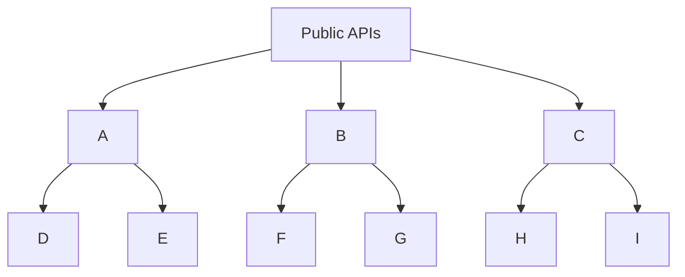

A request to `A` might require only `A`, `D` and `E`.

If `H` fails, nobody using `A` cares.

That is useful separation.

Now consider:

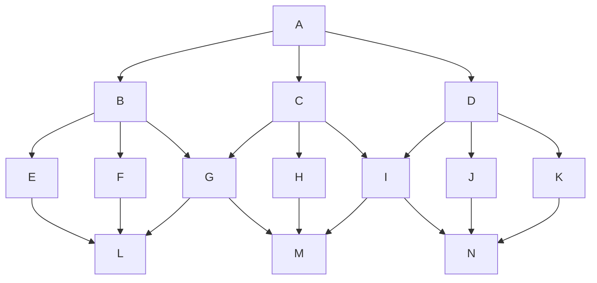

A single operation entering at `A` may transitively depend on a substantial
percentage of the graph.

These are completely different architectures despite potentially having
exactly the same number of services.

The useful question is therefore not:

> How many services do we have?

It is:

> **How many services must be healthy for this operation to work?**

That is the operation's real failure surface.

## 3. Deployment Boundaries and Failure Boundaries Are Different Things

A service boundary is often justified partly on the basis of fault
isolation.

The expectation is:


The failure should stop somewhere useful.

But consider:


If every service is a mandatory synchronous dependency, then a failure in
any one of A, B, C or D fails the whole operation.

There are four deployment boundaries.

There is effectively one failure boundary.

Worse, compared with a single process, we have introduced additional
opportunities for failure:

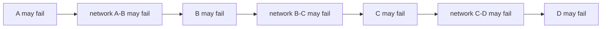

The existence of more services has not automatically increased resilience.

It may simply have increased the number of things required for success.

A deployment boundary only becomes a useful failure boundary when failure can
actually be contained there.

## 4. The Common Data Service

A pattern that deserves particular attention is this:

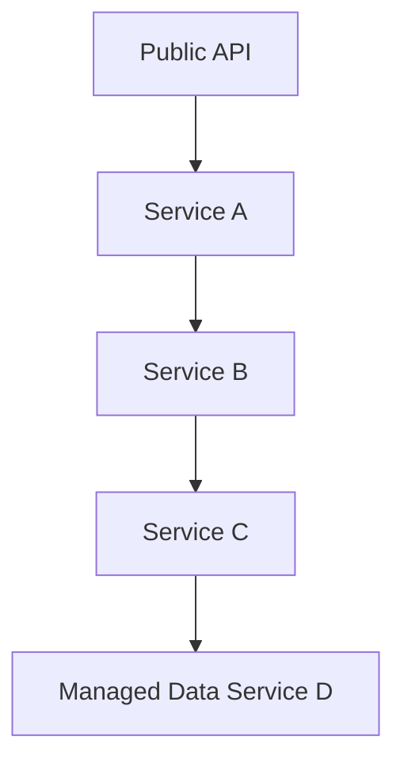

The upper services may all perform legitimate processing. They may
transform data, enrich data, map representations, apply rules, filter
results, and aggregate results.

They are therefore doing real work.

That does not by itself justify making each stage a separate service.

If all useful operations ultimately require a live call to `D`, then `D`
defines the availability of the complete chain.


`D` remains a transitive single point of failure.

The services above it have provided functional separation.

They have not provided availability independence.

That distinction matters.

## 5. Doing Something Does Not Make Something a Service

This is an important mistake in service design.

The argument sometimes becomes:

> This component performs a separate responsibility, therefore it should be a
> separate service.

That does not follow.

Consider:

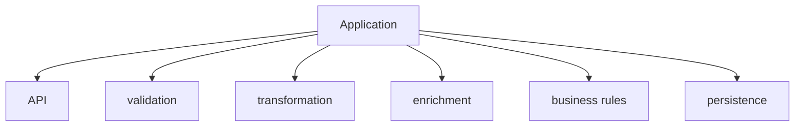

These are clearly different responsibilities. They can have clear
interfaces, separate modules, independent tests, strong ownership rules, and
restricted dependencies.

None of that requires a network boundary.

Now convert the same design into:

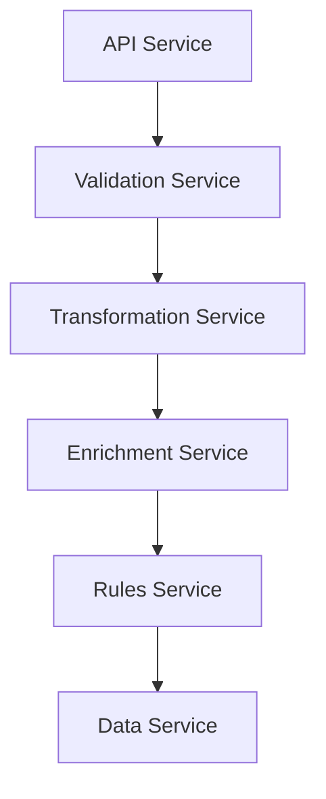

The logical dependency still exists.

What has changed is the mechanism.

Local calls have become distributed calls.

We have now added: network latency, serialization, authentication, TLS,
timeouts, retries, service discovery, API compatibility, distributed
tracing, health checks, deployment coordination, and partial failure.

The right question is not:

> Does this service do something?

Of course it does.

The right question is:

> **What useful independence do we gain by putting a network boundary here?**

If there is no convincing answer, it probably should not be a separate
service.

## 6. Service Fragmentation

This is what I mean by **service fragmentation**.

Service fragmentation occurs when a cohesive capability is split across
separately deployed services without actually separating the capability.

The resulting services remain coupled because they call each other
synchronously, must be available together, evolve together, share
end-to-end semantics, depend on the same underlying data, and require
coordinated delivery.

For example:

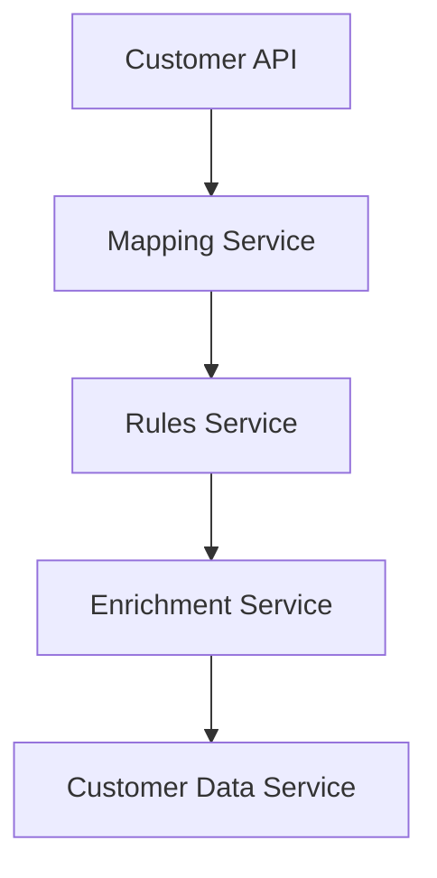

There may be five deployments.

There are not necessarily five independent capabilities.

If every meaningful customer operation needs all five, what we really have is
one distributed customer capability.

The implementation has been fragmented.

The capability has not.

That is the difference between **service decomposition** and **service
fragmentation**.

## 7. What Real Service Decomposition Looks Like

A useful contrast is the architectural style associated with systems such as
Netflix.

The following is deliberately simplified. It is not intended to claim that
these are Netflix's exact internal service names or topology.

Imagine a streaming platform with capabilities such as: Authentication,
Streaming, Search, Categories, Recommendations, Viewing History, and
Billing.

These are recognisable capabilities.

A sensible service architecture might look something like:

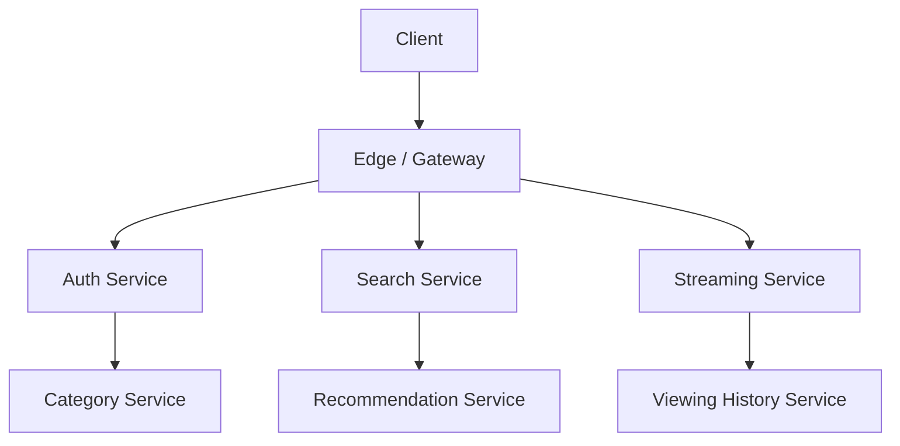

There will obviously be dependencies and interactions.

The important difference is that each service aims to own enough of its
universe to perform its job.

For example:

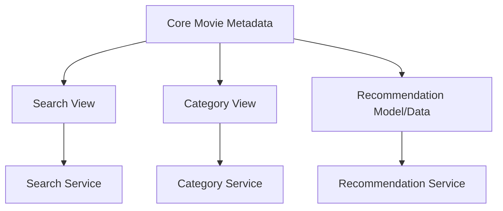

The core metadata is distributed into the representations required by the
individual capabilities.

The request path does **not** need to look like:

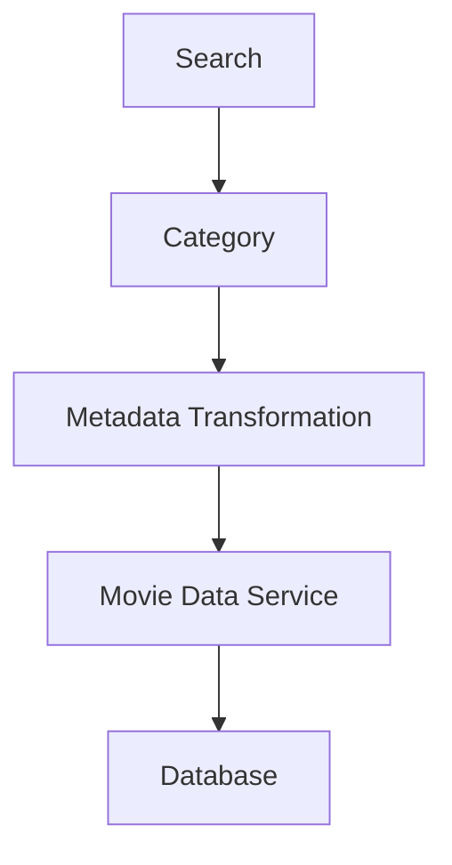

for every search request.

Instead, conceptually:

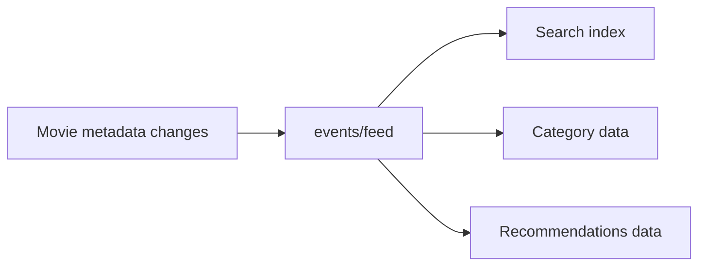

Each service maintains the state required for its own capability.

Search owns its searchable universe.

Category owns its category universe.

Recommendation owns its recommendation universe.

Streaming owns the information required to initiate and manage streaming.

Authentication owns authentication state.

They may all ultimately derive some of their information from common
sources.

That does not mean they need to synchronously traverse those common sources
for every request.

Netflix has publicly described this kind of approach in a number of systems:
distributing information through Kafka into local service state and
deliberately removing multi-service runtime dependency chains where they have
become sources of fragility.

The distinction is fundamental.

The services are fed from common information.

They are not necessarily runtime wrappers around that information.

## 8. Owning Your Universe

This is probably the most important characteristic of a useful service.

A service should, as far as practical, **own the universe required to
provide its capability**.

Consider search.

A poor decomposition might be:

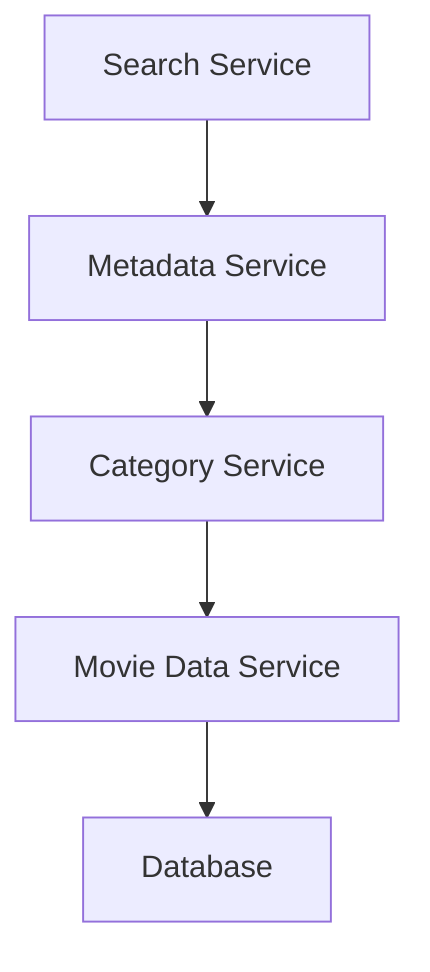

A search request is now dependent on the complete chain.

If the Category Service is unavailable, search may fail.

If the Movie Data Service is slow, search becomes slow.

If the Metadata Service changes its paging behaviour, search may need to
change.

Search does not really own search.

It owns an API on top of somebody else's runtime capability.

Compare that with:

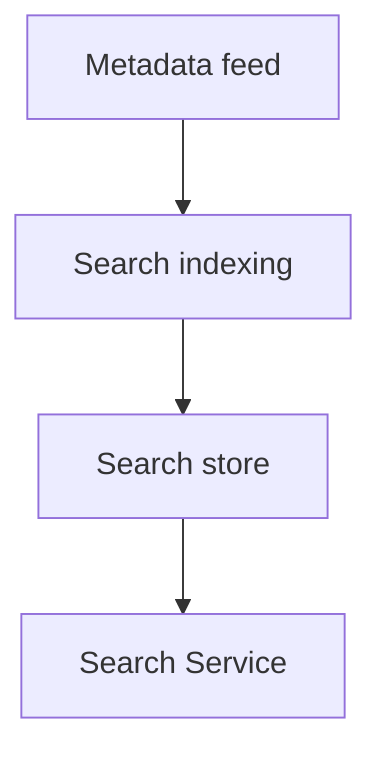

Now: `Client -> Search Service -> Search-owned data`.

The metadata source can be temporarily unavailable and existing search can
potentially continue.

Search can choose indexing structures appropriate for search.

Search can add fields useful only to search.

Search can change its ranking model.

Search can page in the way that makes sense for search.

Search can scale based on search traffic.

That is meaningful service autonomy.

Search owns its universe.

## 9. Shared Source Does Not Mean Shared Runtime Dependency

This is a subtle but important distinction.

There is nothing inherently wrong with having a core movie metadata store.

In fact, having an authoritative source of metadata is useful.

The question is how other capabilities consume it.

One model is:

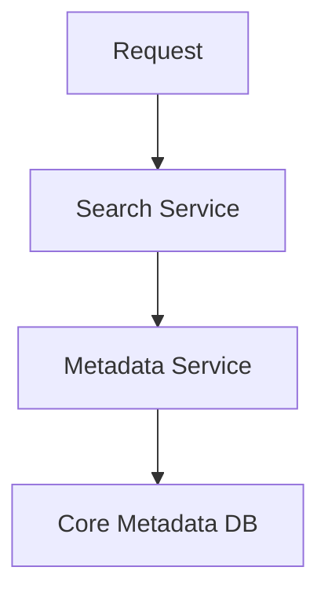

Every search request requires the metadata stack.

Another is:

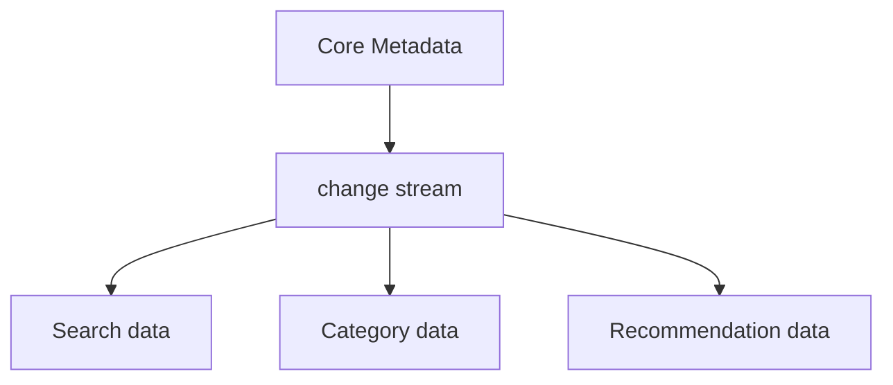

Now the core metadata system is the source of truth, but it is not
necessarily in the synchronous request path.

That is a significant architectural difference.

The system can have one authoritative source without every service being a
remote view over that source.

## 10. Data Duplication Is Not Automatically Bad

This sometimes creates resistance because the second model duplicates data.

That is true.

It may be exactly what we want.

For example, the same movie may exist as: a core metadata representation, a
search index representation, a category representation, a recommendation
feature representation, and a streaming entitlement representation.

These are not necessarily bad duplicates.

They are different service-owned representations of the same underlying
entity.

Search does not necessarily need the canonical movie object.

It needs the representation useful for search.

Recommendations need something else.

Streaming needs something else again.

Trying to force every capability through one canonical runtime data model can
create enormous coupling.

Some controlled data duplication can be much cheaper than runtime coupling.

## 11. The Difference Is Failure Behaviour

The difference becomes obvious when the core metadata service goes down.

With runtime dependency:

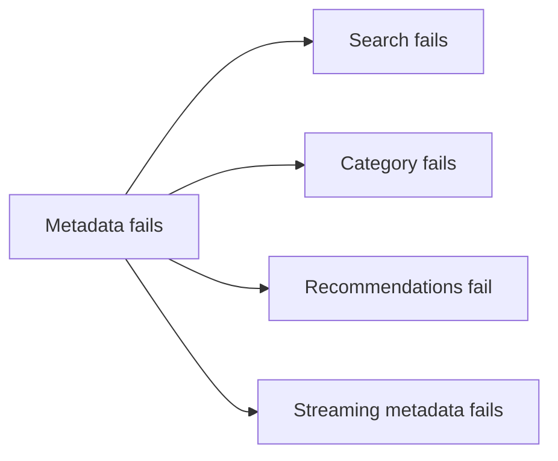

One service failure takes out multiple capabilities.

With locally owned state:

```mermaid
graph TD
    F[Metadata feed fails] --> P[new metadata temporarily stops propagating]
    P --> S[Search continues with existing index]
    P --> C[Categories continue with existing data]
    P --> R[Recommendations continue with existing data/model]
    P --> O[Other capabilities continue where their semantics allow]
```

The information may become stale.

That is different from the capability becoming unavailable.

This is what a real failure boundary looks like.

## 12. Failure Isolation Requires State Independence

A service that owns no useful state and synchronously calls another service
for everything is inherently limited in how independently it can fail.

Consider:

```mermaid
graph LR
    A --> B --> C --> D
```

If A contains no useful information without B, and B contains no useful
information without C, then independence is mostly an illusion.

Now consider:

```mermaid
graph TD
    Data[Authoritative Data] --> A
    Data --> B
    Data --> C
    A --> AS[A state]
    B --> BS[B state]
    C --> CS[C state]
```

Now failure can be isolated.

If B disappears, A and C still work.

If the authoritative data feed disappears, A, B and C may all continue on
slightly stale state.

Obviously not every domain permits stale information.

Authentication, financial transactions and other strongly consistent
operations have different requirements.

But the architectural decision should be driven by those requirements rather
than automatically creating a synchronous graph.

## 13. Independent Deployment Is Not Independent Evolution

Returning to the original argument:

> The services are separate so they can be improved independently.

That statement needs testing.

Take `A -> B -> C -> D`. If a useful change to A frequently requires D to
change, which requires C to change, which requires B to change, which
finally allows A to change, then that is not independent evolution.

It is a distributed feature implementation.

The services may be independently deployed.

The capability is being jointly implemented.

The real delivery path becomes:

```mermaid
graph LR
    TD[Team D] --> TC[Team C] --> TB[Team B] --> TA[Team A] --> Consumer
```

That is a dependency queue.

## 14. Paging Exposes This Immediately

Paging is a very good example because it looks trivial.

Assume `A -> B -> C -> D`, and A needs `GET /items?page=5&size=100`.

It looks like an A feature.

It probably is not.

For efficient and correct paging, D may have to understand limit, offset,
cursor and ordering semantics. C may have to preserve those semantics. B may
have to preserve them again. A finally exposes them.

```mermaid
graph LR
    A[A needs paging] --> B[B needs paging semantics] --> C[C needs paging semantics] --> D[D needs suitable data access]
```

The services may have perfectly backward-compatible APIs.

That is irrelevant.

The feature still has to propagate through the graph.

The coupling is semantic.

## 15. Semantic Coupling Is More Important Than API Compatibility

Breaking API changes are obvious.

Semantic coupling is more subtle.

Consider: paging, filtering, sorting, stable ordering, projection, total
counts, temporal queries, consistency, idempotency, optimistic locking,
security filtering, and entitlement filtering.

These may all need to propagate through a service hierarchy.

```mermaid
graph TD
    Req[Public requirement] --> A[Service A semantics] --> B[Service B semantics] --> C[Service C semantics] --> D[Data semantics]
```

That is not independent evolution.

The feature is implemented by the graph.

## 16. The Contract Super-Service

Now consider service A acting as a unified API across B, C and D.

There are two completely different cases.

The first is genuine aggregation:

```mermaid
graph TD
    Caller --> A
    A --> B
    A --> C
    A --> D
```

A creates a capability that does not exist anywhere else.

For example, `GET /customer-overview` might combine B's account
information, C's customer information, and D's product information.

A owns that capability.

It makes complete sense for A to own the API.

The second case is:

```mermaid
graph LR
    Caller --> A --> B
```

where A merely forwards the call.

That is not aggregation.

It is routing.

If A nevertheless takes B's API and republishes it as part of A's own
contract, A has become a **contract super-service**.

## 17. Contract Ownership Creates Another Dependency

Suppose B exposes `GET /accounts`.

A republishes this as part of the unified A API.

Now B adds paging.

If B owned the consumable API directly:

```mermaid
graph LR
    B1[B adds paging] --> B2[B publishes API] --> C1[consumer uses it]
```

If A owns the external contract:

```mermaid
graph TD
    B1[B adds paging] --> A1[A team understands change]
    A1 --> A2[A OpenAPI changes]
    A2 --> A3[A implementation changes]
    A3 --> A4[A tests change]
    A4 --> A5[A deployed]
    A5 --> C1[consumer uses paging]
```

The architecture has created a dependency which adds no business capability.

A is now an **evolutionary choke point**.

B is independently deployable.

B is not independently deliverable.

## 18. Unified Entry Point Does Not Mean Unified Contract Owner

There is nothing wrong with `api.example.com` being the single way into the
platform.

A gateway can provide authentication, security policy, routing, rate
limiting, telemetry and observability.

For example:

```mermaid
graph LR
    G[api.example.com] -->|"/api/search/*"| Search[Search Service]
    G -->|"/api/category/*"| Category[Category Service]
    G -->|"/api/stream/*"| Stream[Streaming Service]
    G -->|"/api/account/*"| Account[Account Service]
```

Each service can still own its contract.

The gateway owns the route.

Where aggregation exists, at `/api/homepage`, an aggregator may own that API
because it genuinely creates the result from several services.

This gives a simple model:

> **The service owns its capability.**
>
> **The gateway owns the route.**
>
> **The aggregator owns the composition.**

This is much cleaner than making one service pretend to own everything.

## 19. Aggregation Justifies Abstraction. Routing Does Not.

This distinction is worth stating explicitly.

If A calls B, C and D, then combines the results into something new, A
provides an abstraction.

A should own that abstraction.

If A simply forwards a request to B and returns the response, A has added no
semantic abstraction.

It has added a route.

Making A re-own B's contract in that case does not increase encapsulation.

It increases coupling.

So:

> **Aggregation justifies abstraction. Routing does not.**

## 20. The Contract Super-Service Undermines Team Independence

This also becomes an organisational problem.

The advertised structure may be that Team B owns B, Team C owns C, and Team
D owns D.

Each team supposedly owns its service.

But if every consumer-facing capability must pass through A:

```mermaid
graph LR
    TB[Team B] --> B[Service B] --> TA[Team A] --> A[Service A] --> Consumer
```

then Team B does not actually control delivery of its capability.

It can implement the feature.

It can deploy the feature.

But it cannot expose the feature without Team A.

The architecture has recreated cross-team release coordination through the
contract layer.

That is another form of service fragmentation.

## 21. Pointless Service Dependencies

Not every dependency is bad.

Services have to interact.

The question is whether each dependency has a reason to exist.

A suspicious dependency often has several of these characteristics:
synchronous, mandatory, no degraded behaviour, no independent business
capability, no meaningful scaling distinction, no useful security boundary,
no fault isolation, common underlying data dependency, coordinated
evolution, and propagated semantics.

Again, the downstream service may perform substantial processing.

That is not the question.

The question is:

> **What architectural benefit comes from doing that processing in another
> network process?**

If the answer is effectively "because it is a separate responsibility",
then that is probably not enough.

Responsibilities can be modules.

Services need a stronger justification.

## 22. Every Synchronous Edge Has a Price

A synchronous service call is not free.

Every edge `A -> B` adds latency, an availability dependency, a timeout,
retry behaviour, authentication, a contract, an operational dependency, and
another place where behaviour must be traced.

Add enough edges and the graph itself becomes the problem.

For example:

```mermaid
graph LR
    A --> B --> D
    A --> C --> E --> F
    F --> C
```

Now failure propagation is a graph problem.

Feature delivery is a graph problem.

Testing is a graph problem.

Debugging is a graph problem.

At that point the architecture is generating complexity rather than
controlling it.

## 23. Deep Dependencies Amplify Failure

Suppose `A -> B -> C -> D` and D becomes slow.

Then C waits for D, B waits for C, A waits for B, and the caller waits for
A.

Connections are consumed.

Threads are occupied.

Queues grow.

Then retries appear: A retries B, B retries C, C retries D.

A small problem at D can now produce a much larger load against D.

The system needs circuit breakers, bulkheads, retry budgets, back-pressure,
load shedding, and distributed tracing.

Those are all useful tools.

But it is worth remembering why they are required.

They are required because there are network boundaries.

If the network boundary has bought us no meaningful independence, we have
added the distributed-system cost without getting much back.

## 24. Availability Follows the Mandatory Dependency Graph

Take a deliberately simplified example where every service is 99.9%
available.

One mandatory service: `99.9%`.

Five independent mandatory services in sequence: `0.999 ^ 5 ~= 99.5%`.

Ten: `0.999 ^ 10 ~= 99.0%`.

Real failures are not independent, so this is not an availability model.

It is simply illustrating something obvious:

> **Every mandatory synchronous dependency is another way for the operation
> to fail.**

Putting a component in its own container does not improve the availability
of a request if the request now depends on that container as well.

## 25. Compare the Two Architectural Styles

### Fragmented service architecture

```mermaid
graph TD
    API[Public API] --> A
    A --> B & C & D
    B --> E
    C --> E & F
    D --> F
    E --> G
    F --> G
    G --> Store[Managed Data Store]
```

Characteristics: a large synchronous dependency graph, capabilities that
propagate through layers, teams that depend on teams, paging/filtering/
sorting that propagates downward, failures that propagate upward, a common
data dependency sitting on the request path, many deployment boundaries, and
few useful failure boundaries.

### Capability-owned service architecture

```mermaid
graph TD
    Meta[Core Metadata] --> Feed[change/event feed]
    Feed --> SS[Search Store] --> Search[Search Service]
    Feed --> CS[Category Store] --> Category[Category Service]
    Feed --> RS[Recommendation Store] --> Rec[Recommendation Service]
    Auth[Auth Service] --> AState[own state]
    Stream[Streaming Service] --> StState[own state]
    Hist[History Service] --> HState[own state]
```

Characteristics: services own capabilities, services own the state required
by those capabilities, common source data is distributed rather than
repeatedly fetched, the runtime dependency graph is smaller, failure
boundaries are meaningful, service-specific data models are possible, teams
can evolve capability-specific behaviour, and temporary source failure can
often mean stale data rather than total failure.

That is a much more useful form of service independence.

## 26. The Netflix-Style Example

A simplified Netflix-style system makes the distinction particularly clear.

Imagine: Auth Service, Search Service, Streaming Service, Category Service,
Recommendation Service, and History Service.

All of them may be influenced by a common catalogue of movies, programmes and
associated metadata.

The naive fragmented design is:

```mermaid
graph LR
    Search --> Category --> Metadata --> MovieData[Movie Data]
    Rec[Recommendation] --> Category
    Stream[Streaming] --> Metadata
    Hist[History] --> Metadata
```

Now Movie Data is in almost every runtime path.

Metadata failure affects everything.

Category failure can unexpectedly affect search.

Changes to metadata semantics ripple into multiple services.

Instead, distribute the information:

```mermaid
graph TD
    Meta[Movie Metadata] --> Events
    Events --> SI[Search index] --> SS[Search Service]
    Events --> CD[Category data] --> CS[Category Service]
    Events --> RD[Recommendation data] --> RS[Recommendation Service]
    Events --> StD[Streaming data] --> StS[Streaming Service]
```

Each service now owns the representation appropriate to its capability.

Search is not a remote metadata query service.

It is the search system.

Category is not a thin wrapper around a central movie record.

It owns the category view.

Recommendation owns the data and models necessary to recommend.

Streaming owns the state required to deliver streams.

Authentication owns authentication.

This is much closer to genuine service independence.

## 27. Holding the Entire Universe of the Capability

When I say a service should "own its universe", I do not mean it must be
disconnected from everything else.

I mean it should contain enough of the state and logic relevant to its
capability that it is not merely a synchronous adapter around another
service.

For Search: search indexes, search-specific metadata, ranking information,
search paging, and search filtering belong naturally in the Search
universe.

For Category: category membership, category ordering, and category
presentation information belong in the Category universe.

For Recommendations: recommendation candidates, features, models/results,
and ranking belong in that universe.

The common metadata store remains authoritative for common facts.

But the runtime capability should not necessarily depend on walking back to
that authoritative store for every operation.

This is where data propagation becomes useful.

## 28. Freshness and Availability Are a Trade-Off

This design does introduce a trade-off.

If the common metadata feed fails, downstream views may become temporarily
stale.

But compare "metadata unavailable, search data 2 minutes stale" with
"metadata unavailable, search unavailable".

Those are very different failure modes.

For many capabilities, stale-but-correct-enough information is vastly
preferable to complete outage.

For some capabilities, of course, it is unacceptable.

Authentication, entitlement enforcement, balances, financial posting and
similar operations may require much stronger consistency.

That is fine.

The point is not that every service should cache everything.

The point is:

> **The consistency and dependency model should follow the requirements of
> the capability, not an assumption that every service should synchronously
> ask another service for its data.**

## 29. Duplication Can Buy Decoupling

There is a tendency to treat duplicated data as inherently bad.

In a service architecture, that can be exactly backwards.

Avoiding all duplication frequently produces:

```mermaid
graph TD
    A[Service A] --> Canon[Canonical Service]
    B[Service B] --> Canon
    C[Service C] --> Canon
    D[Service D] --> Canon
```

which produces runtime coupling.

Controlled duplication can instead produce:

```mermaid
graph TD
    Canon[Canonical source] --> AV[A view] --> A
    Canon --> BV[B view] --> B
    Canon --> CV[C view] --> C
```

The data is duplicated.

The runtime dependency is not.

Storage is cheap.

Cross-service synchronous coupling is not.

## 30. The Real Test for a Service Boundary

For every service boundary, ask:

**Failure** — If this service disappears, what else stops working? Does the
failure stop at a sensible boundary?

**Evolution** — Can this service implement a significant feature without
another service changing?

**Delivery** — Can its owning team expose that feature without another
team's release?

**State** — Does it own enough state to perform its capability, or does it
fetch its entire world synchronously from somewhere else?

**Semantics** — Are paging, filtering, sorting and other semantics local to
the capability, or do they propagate through several services?

**Scaling** — Does it actually have independent scaling requirements?

**Security** — Is there a real trust boundary?

**Domain** — Does it represent a recognisable capability, or just one
processing stage?

**Operations** — Can it degrade, restart, roll back or fail without taking
unrelated capabilities with it?

If most of the answers indicate dependence, the network boundary needs a very
good justification.

## 31. Measure the Graph Rather Than Counting the Boxes

For each public operation, measure:

* maximum synchronous dependency depth
* number of transitive synchronous dependencies
* number of mandatory dependencies
* number of optional/degradable dependencies
* number of service failures capable of failing the operation
* number of services normally changed for a feature
* number of teams required to deliver that feature
* percentage of data obtained synchronously from another service

These tell us considerably more than:

> We have 43 services.

## 32. The Diagram Can Lie

A diagram containing four independent-looking boxes — A, B, C, D — looks
like four independent things.

Kubernetes sees four deployments.

Git sees four repositories.

CI sees four pipelines.

Management sees four owning teams.

But if A requires B, B requires C, and C requires D, then the business
capability is still one thing.

```mermaid
graph LR
    A --> B --> C --> D
```

The independence is largely packaging.

That is one of the clearest symptoms of service fragmentation:

> **There are more deployment boundaries than behavioural boundaries.**

Or, more simply:

> **The boxes are independent. The capability is not.**

## 33. A Distributed Monolith Is Not the Only Failure Mode

"Distributed monolith" is often used to describe this kind of system.

Sometimes it is accurate.

But **service fragmentation** is more useful because it describes how we got
there.

The problem is not merely that everything is coupled.

The problem is that a capability has been broken into increasingly small
distributed pieces without creating corresponding independence.

That fragmentation then produces distributed coupling, deep dependency
graphs, semantic propagation, failure propagation, team dependencies,
contract dependencies, and release dependencies.

The result can behave like a monolith at runtime while being considerably
more difficult to reason about and operate than an actual monolith.

## 34. What a Good Service Boundary Buys

There are plenty of valid reasons to create a service.

A good service boundary may provide: fault isolation, independent scaling,
independent evolution, independent delivery, independent data ownership,
separate security boundaries, separate lifecycle requirements, a
recognisable business capability, asynchronous interaction, and independent
operational behaviour.

These benefits justify the cost of distribution.

If the boundary provides none of them, then the fact that two pieces of code
have different responsibilities is not enough.

They can be modules.

## 35. The Core Fallacy

The fundamental fallacy is:

> **Splitting a capability into independently deployable services does not
> make the capability independent.**

If those services have to be available together, have to change together,
have to understand the same end-to-end semantics, have to coordinate
delivery, and depend on the same critical downstream service, then they
remain coupled.

The mechanism of coupling has simply changed.

Instead of local coupling, there is distributed coupling.

Repeat that enough times and we get **service fragmentation**.

## Conclusion

The objective of a service architecture should not be to create as many
independently deployable things as possible.

It should be to identify where useful independence actually exists.

A service boundary should buy something.

It should provide some combination of: failure isolation, capability
ownership, independent evolution, independent delivery, independent
scaling, data ownership, and security separation.

If it buys none of those things, it is difficult to justify putting a
network boundary there.

A good multi-service architecture might have an authentication service, a
search service, a streaming service, a recommendation service and a category
service.

They may all receive information originating from the same authoritative
movie metadata.

That does not mean every request should synchronously walk back through a
shared movie metadata service.

Each capability should, where its requirements permit, own the data and
behaviour necessary to provide that capability.

Search should own search.

Categories should own categories.

Streaming should own streaming.

Authentication should own authentication.

Recommendations should own recommendations.

The services can share sources of truth without sharing every runtime
dependency.

That produces actual failure boundaries.

It permits different data models.

It allows capabilities to evolve independently.

It reduces the amount of the service graph that must be alive for any
individual operation.

By contrast, a system where requests pass through several mandatory service
layers, where paging and filtering changes propagate through those layers,
where teams wait for other teams before exposing new capabilities, and where
the complete graph ultimately terminates at one synchronous data service is
not demonstrating useful decomposition merely because each box can be
deployed independently.

It is very likely demonstrating **service fragmentation**.

The boxes are independent. The capability is not.

The deployments are independent. The delivery is not.

The APIs are separate. The semantics are not.

The processes are separate. The failure boundary is not.

Good service architecture distributes independent capabilities.

**Service fragmentation merely distributes the dependency graph.**

!!! note "On the Netflix example"
    The Netflix-style section is deliberately an architectural illustration
    rather than a claim that Netflix literally has exactly those six
    services. Their published engineering work does, however, give solid
    examples of the underlying principles: domain services keeping
    distributed state locally rather than adding request-path dependencies,
    and removing fragile multi-service dependency chains in favour of
    authoritative data and purpose-built abstractions ([Netflix TechBlog][1]).

[1]: https://netflixtechblog.com/https-medium-com-netflix-techblog-simone-a-distributed-simulation-service-b2c85131ca1b
